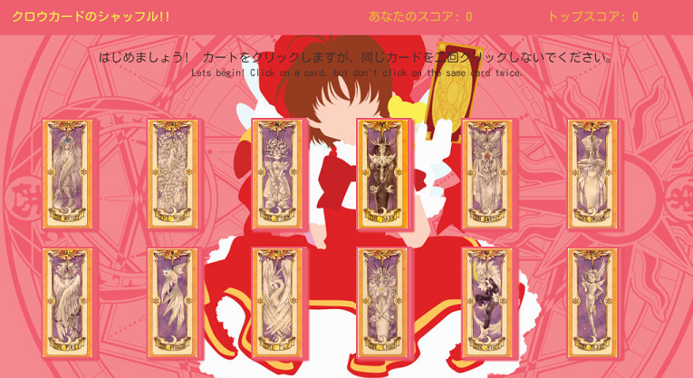

# **カードキャプチャーのクリックゲーム　（Card Capture Clicky-Game)**

### **What is this "Clicky-Game" you speak of?**
"Card Capture Clicky-Game" is a single page React app that is a memory game. The objective is to remember which images you have already clicked in order to increase your score. If you click on an image you already clicked before, clicking another image will restart the game, but your top score will be saved for your session and update when you beat your top score. Total possible points is 12. 

### **Why this game?**
Better question is "Why not?". Why not enjoy playing a simple memory game with a CLAMP (Card Captor Sakura) theme?

### **How to get started**
Getting started is simple, just follow the link below:

[Card Captor Clicky-Game Link!](https://motoko104.github.io/clicky-game/)

and now you can play!

### **Future Development**
More responsive to play on mobile, and adding animation to have the cards flip over. Possibly turning this into a memory game by position rather than just memorizing what was clicked and what was not.

### **Need Help?**
If you need help with this app, or have any comments, complaints, or outright objections, please contact myself (Amanda Padilla), and i will be sure to respong in a timely manner.

I maintainand contribute solely to this repository.

All characters and images are created by the mangaka group CLAMP, series "Card Captor Sakura" (give it a watch if youve got the time for a cute old anime).